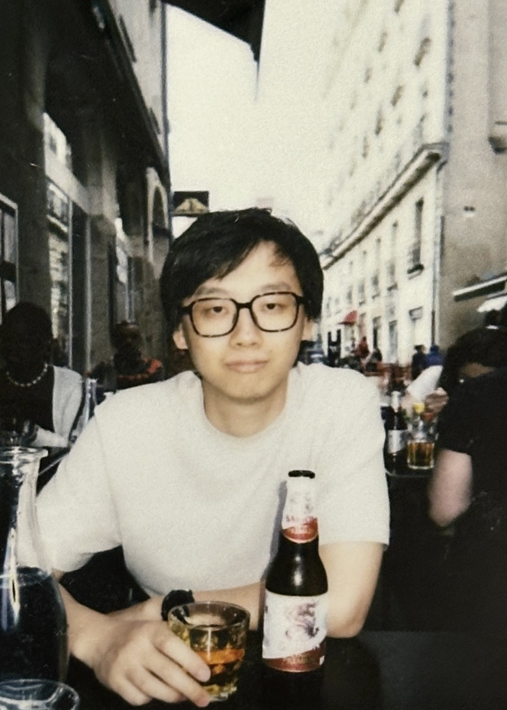

Hello! I am currently a PhD student in the [CS theory group](https://theory.cs.northwestern.edu/) in Northwestern University, where I am advised by [Prof Samir Khuller](https://www.samirkhuller.com/) and co-advised by [Prof Varun Gupta](https://www.varungupta.info/) and [Prof Gruia Calinescu](http://www.cs.iit.edu/~calinesc/). 
Before joining Northwestern, I worked as a research assistant in Nanyang Technological University, advised by [Prof Tang Xueyan](https://personal.ntu.edu.sg/asxytang/). 
I got my Bachelor's degreee in Applied Mathematics from National University of Singapore. 

I have been working on some scheduling problems, in offline or online settings, via designing deterministic algorithms. One direction is to find improved algorithms to some problems that have been studied before. The other is to think of new variations of fundamental models. Going beyond the scheduling problems, I am interested in related mathematics, such as stochastic processes, linear algebra and integer programming. 
